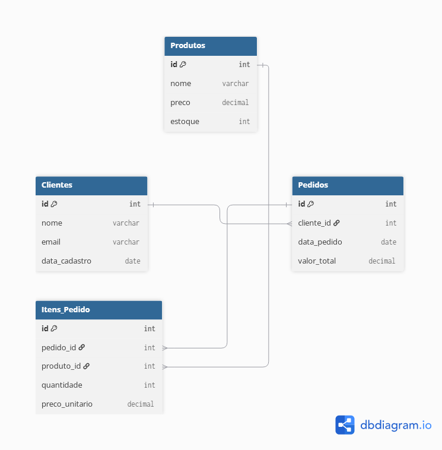

# 🛒 Modelagem de Banco de Dados para E-Commerce

Este projeto apresenta a estrutura e modelagem de um banco de dados relacional para uma plataforma de e-commerce fictícia. O objetivo é registrar clientes, produtos, pedidos e os itens de cada compra com integridade referencial.

---

## 📌 Diagrama Entidade-Relacionamento (DER)

---

## 📐 Estrutura do Banco de Dados

O banco é composto por 4 tabelas principais:

1. **`Clientes`**: Armazena as informações dos compradores (`id`, `nome`, `email`, `data_cadastro`).
2. **`Produtos`**: Contém a lista de produtos disponíveis, preços e estoque (`id`, `nome`, `preco`, `estoque`).
3. **`Pedidos`**: Registra as compras efetuadas, vinculando-as aos clientes via Chave Estrangeira (`id`, `cliente_id`, `data_pedido`, `valor_total`).
4. **`Itens_Pedido`**: Tabela associativa responsável por permitir múltiplos produtos por pedido (`id`, `pedido_id`, `produto_id`, `quantidade`, `preco_unitario`).

---

## 🛠️ Tecnologias e Conceitos Utilizados

* **Linguagem DDL (Data Definition Language)** para criação da estrutura SQL.
* **DBML / DBDiagram.io** para geração do DER visual.
* **Relacionamentos e Chaves**: Uso de Chaves Primárias (`PRIMARY KEY`), Chaves Estrangeiras (`FOREIGN KEY`) e restrições (`UNIQUE`, `NOT NULL`).
* **Relacionamento N:N (Muitos para Muitos)** resolvido através de tabela associativa.

---

## 📂 Como Executar os Scripts

O arquivo `schema.sql` contém todos os comandos SQL necessários para criar as tabelas em um banco de dados relacional (como PostgreSQL ou MySQL).
